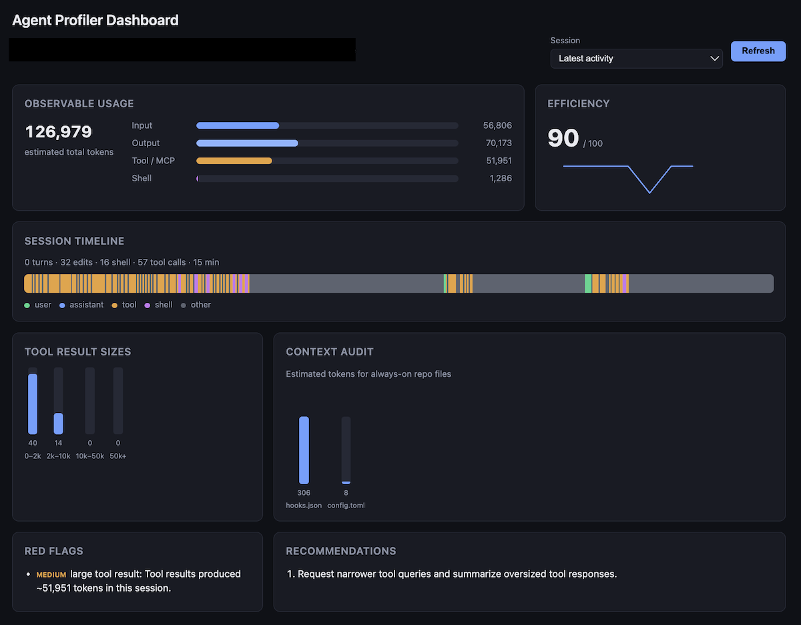
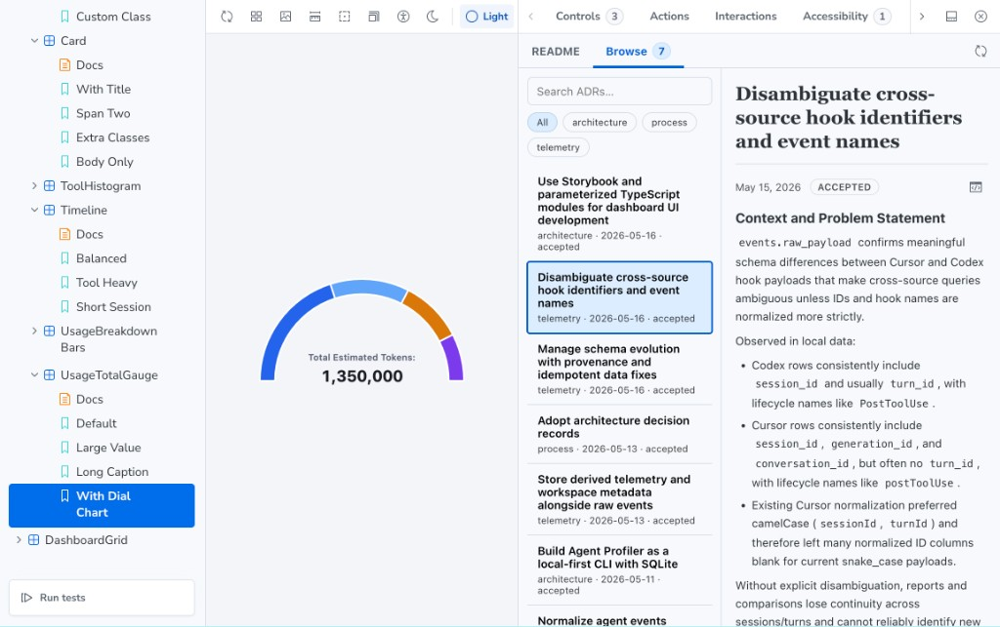

# Agent Profiler

## What's New in v1.1.0

The dashboard and developer workflow got a big refresh:

- **Sharper dashboard UI** — usage gauge, efficiency sparkline, session timeline, tool histograms, and context audit in a cohesive dark-friendly layout (light mode too).
- **Storybook for dashboard components** — develop and document UI modules in isolation with `npm run storybook` (repo contributors).
- **ADRs in Storybook** — browse and search architecture decision records from the **Architecture** panel while you work on stories.
- **Light / dark themes** — toggle themes in Storybook and the shipped dashboard via shared `data-theme` tokens.
- **Stronger telemetry** — canonical cross-source hook event names, Cursor/Codex ID normalization, and safe schema evolution with provenance-backed backfills.





**Agent Profiler** is a **local-first** tool for understanding how AI coding agents spend observable effort in your workspace. It records Cursor, Codex, Claude, and OpenCode telemetry into **SQLite** so you can review session shape, estimated token usage, tool and shell noise, always-on context weight, and simple efficiency signals—**without sending telemetry to a remote service.**

Today the workflow is intentionally scoped **project-by-project**: you run commands from a repo root, store profiler config and data under **`.agent-profiler/`** beside that project, and inspect sessions with the CLI or the optional dashboard. **A future direction** is to offer a clearer opt-in path to operate primarily from the **home-directory** profile (for example global installs and multi-repo DB layout) when users want that; the current release optimizes for **per-repo isolation** and predictable paths.

On **`agent-profiler init`** in **dev** mode, when the profiler directory resolves to **`<project>/.agent-profiler`**, the tool **appends a `.gitignore` rule** so the local store (including SQLite and synced dashboard assets) is **not committed** by mistake.

## Dashboard

Run a minimal **localhost-only** web UI over the same database and context audit used by `last`:

```bash
agent-profiler dashboard
# open http://127.0.0.1:3737/ — use Refresh to reload metrics
```

The dashboard surfaces:

- **Observable usage** — estimated input, output, tool/MCP result, and shell output tokens with simple bar proportions
- **Efficiency score** — heuristic score with a small sparkline over recent keyed sessions (when present)
- **Session timeline** — chronological strip colored by role (user, assistant, tool, shell, other)
- **Tool result sizes** — histogram buckets for large tool payloads
- **Context audit** — estimated tokens for common always-on instruction paths in the repo
- **Red flags and recommendations** — aligned with the `last` command logic

Static assets are copied into **`.agent-profiler/dashboard/`** when the server starts so the UI stays next to your project data.

### UI development (contributors)

Dashboard markup lives in **`packages/dashboard/src/ui/`** and is exercised in **Storybook** (not shipped in the npm package):

```bash
npm run storybook
# http://127.0.0.1:6006 — component stories, theme toolbar, Architecture (ADR) panel
```

## Requirements

- Node.js 22 or newer
- macOS, Linux, or another environment supported by `better-sqlite3`

## Install

For one-off commands, use `npx`:

```bash
npx agent-profiler --help
npx agent-profiler last
```

For persistent hook installation, install the package so `agent-profiler` is available on `PATH`:

```bash
npm install -g agent-profiler
agent-profiler --help
```

## Quick Start

Initialize hooks for Cursor:

```bash
agent-profiler init cursor --mode prod
```

Initialize hooks for Codex:

```bash
agent-profiler init codex --mode prod
```

Initialize hooks for Claude:

```bash
agent-profiler init claude --mode prod
```

### OpenCode

OpenCode uses a separate npm plugin that forwards lifecycle events into the same
`agent-profiler hook opencode` ingest path. Install the CLI globally, register the
plugin, and ensure OpenCode can resolve the package (see
[`packages/opencode-telemetry-plugin/README.md`](packages/opencode-telemetry-plugin/README.md)).

```bash
npm install -g agent-profiler
```

In your project `opencode.json` (or global OpenCode config):

```json
{
  "$schema": "https://opencode.ai/config.json",
  "plugin": ["@agent-profiler/opencode-telemetry-plugin"]
}
```

If OpenCode keeps plugin dependencies in a local folder (for example
`.opencode/package.json`), add the same package name there and run `npm install`
in that directory.

The plugin shells out to `agent-profiler` on `PATH`. For local development in
this repository it can fall back to `<repo>/dist/cli.js` when present.

Inspect the resulting setup and the latest captured session:

```bash
agent-profiler status
agent-profiler last
agent-profiler audit context
```

### Hook approval and restarts

- **Codex**: Hooks must be **approved** before they run—confirm when prompted or enable them in the **Codex plugin settings**.
- **Cursor**: **Restart Cursor** after `init` so hook configuration reliably takes effect.
- **Claude**: Review `.claude/settings.json` after `init` and restart Claude Code if needed.
- **OpenCode**: Restart OpenCode after changing `opencode.json` or plugin dependencies. If hooks are silent, confirm `agent-profiler` is on `PATH` (`which agent-profiler`) and check `.agent-profiler/opencode-plugin.log` in the project.

## `npx` vs `--mode prod`

- `npx agent-profiler ...` is great for one-off inspection commands.
- `agent-profiler init <source> --mode prod` writes persistent hook commands that expect `agent-profiler` to be installed on `PATH`.
- `--mode dev` is meant for local development in this repository and writes absolute `node <repo>/dist/cli.js ...` hook commands instead.

## Commands

- `agent-profiler init <cursor|codex|claude>`: install hook wiring for a supported source (OpenCode uses the npm plugin instead of `init`)
- `agent-profiler hook <source> <eventName>`: ingest one hook payload from stdin (`source`: `cursor`, `codex`, `claude`, `opencode`)
- `agent-profiler status`: inspect local setup and ingest state
- `agent-profiler last`: summarize the most recent observed session
- `agent-profiler dashboard`: serve the local dashboard (SQLite + context audit)
- `agent-profiler audit context`: estimate always-on context token footprint

## Hook mappings

Agent Profiler normalizes source hooks into a canonical lifecycle contract so
cross-source telemetry remains comparable.

| Canonical lifecycle event | Cursor hook(s)                     | Codex hook         | Claude hook          | OpenCode plugin event  |
| ------------------------- | ---------------------------------- | ------------------ | -------------------- | ---------------------- |
| `SessionStart`            | `start`, `sessionStart`            | `SessionStart`     | `SessionStart`       | `session.created`      |
| `UserPromptSubmit`        | `beforeSubmitPrompt`               | `UserPromptSubmit` | `UserPromptSubmit`   | `message.updated.user` |
| `PreToolUse`              | `preToolUse`, `beforeMCPExecution` | `PreToolUse`       | `PreToolUse`         | `tool.execute.before`  |
| `PostToolUse`             | `postToolUse`, `afterMCPExecution` | `PostToolUse`      | `PostToolUse`        | `tool.execute.after`   |
| `PostToolUseFailure`      | `postToolUseFailure`               | —                  | `PostToolUseFailure` | `tool.execute.failure` |
| `Stop`                    | `stop`, `sessionEnd`               | `Stop`             | `Stop`               | `session.idle`         |

Version-specific mapping profiles are managed by a central registry so hook
pinning can evolve per platform without mutating historical raw payload data.
See `docs/decisions/telemetry/ADR-008-govern-hook-mappings-as-a-versioned-telemetry-contract.md`.

## Releases

### `agent-profiler` (CLI)

Published automatically with [semantic-release](https://github.com/semantic-release/semantic-release) when conventional commits land on `main`. Pull requests run CI and canary builds; merges to `main` publish to npm and create a GitHub release.

Maintainers do not hand-publish the CLI under normal workflow. To ship a new version:

1. Merge the release branch or PR into `main` with commit messages that match [commitlint](https://github.com/cleverb/agent-profiler/blob/main/commitlint.config.js) (`feat:` → minor, `fix:` → patch, breaking footer → major).
2. Confirm the [Release workflow](https://github.com/cleverb/agent-profiler/actions) succeeds on that push.
3. Verify on npm: `npm view agent-profiler version`.

Local dry-run before merge (optional):

```bash
npm run build
npm run pack:dry-run
node scripts/prepublish-checks.js
```

### `@agent-profiler/opencode-telemetry-plugin`

Published **manually** on its own semver when the plugin changes. It is **not** bumped by the CLI semantic-release job. See [`packages/opencode-telemetry-plugin/README.md`](packages/opencode-telemetry-plugin/README.md) for install and publish steps.

First-time scoped publish requires an npm org for `@agent-profiler` (or publish access to that scope).
